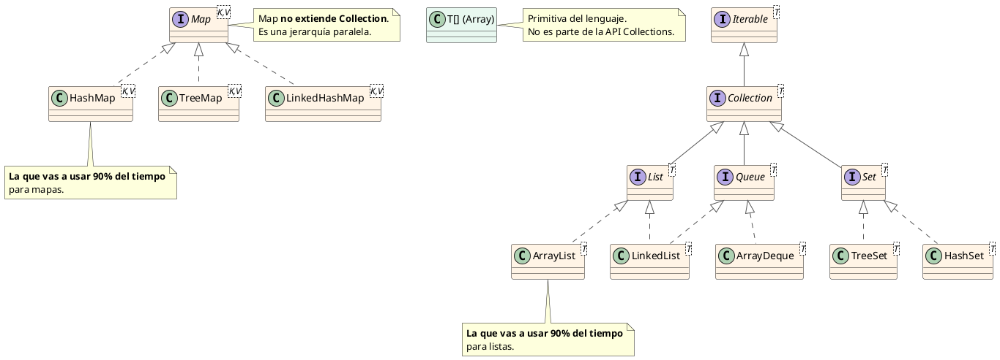

# 📘 Anexo del Bloque 0 — Jerarquía de Collections en Java

> **Para qué es este archivo:** aclarar por qué a veces ves `List`, a veces `ArrayList`, dónde encaja `Array`, qué son los `Map`, y por qué Java parece tener "varias versiones de la misma cosa".
>
> **Cuándo leerlo:** después del Bloque 0 sección 13. Es un zoom-in en la sección de Collections.

---

## 🧭 TL;DR

- **Array** (`T[]`): primitiva del lenguaje, fija en tamaño, NO es parte de la API Collections.
- **Collection**: interfaz raíz de los "contenedores con muchos elementos".
- **List, Set, Queue**: interfaces que **extienden** Collection. Cada una con su semántica.
- **ArrayList, LinkedList, HashSet**: **clases concretas** que implementan esas interfaces.
- **Map**: jerarquía **paralela** — NO extiende Collection.
- **HashMap, TreeMap**: clases concretas de Map.

> **El idiom del 90% de los casos:**
> ```java
> List<Pais> lista = new ArrayList<>();    // declarás el tipo como interfaz, instanciás como clase concreta
> Map<String, Integer> map = new HashMap<>();
> ```

---

## 1. La distinción fundamental: **interfaz** vs **clase concreta**

Antes del diagrama, este concepto es crítico.

### Interfaz (`interface`)

Declara **qué métodos** existen pero **no cómo funcionan por dentro**. Es un contrato:

```java
public interface List<T> {
    void add(T elemento);
    T get(int indice);
    int size();
    // ... más métodos, todos sin cuerpo
}
```

**No podés hacer `new List<Pais>()`** — una interfaz por sí sola no se puede instanciar. Solo declara qué debe ofrecer una "List".

### Clase concreta (`class`)

**Implementa** la interfaz: provee el cuerpo real de los métodos.

```java
public class ArrayList<T> implements List<T> {
    private Object[] datos;   // internamente usa un array
    
    public void add(T elemento) { /* lógica de cómo se agrega */ }
    public T get(int indice) { /* lógica de cómo se accede */ }
    public int size() { /* lógica de cuántos hay */ }
}
```

**Sí podés hacer `new ArrayList<Pais>()`** — es una clase concreta con código real adentro.

### Por qué importa la separación

Permite **programar contra la interfaz, no contra la implementación**:

```java
List<Pais> lista = new ArrayList<>();
// ...
// Más adelante, si necesitás cambiar a otra implementación:
List<Pais> lista = new LinkedList<>();  // ningún otro código se rompe
```

Como `List` es el contrato, cualquier código que use `lista` sigue funcionando, no importa qué implementación concreta haya por debajo. Esto es lo mismo que el principio de "depender de abstracciones, no de implementaciones" — vas a verlo varias veces en DSI.

**Comparación con TS:** en TypeScript es lo mismo conceptualmente:
```typescript
interface List<T> { add(x: T): void; }
class ArrayList<T> implements List<T> { ... }
```

---

## 2. Jerarquía completa — diagrama PlantUML

Si tenés el plugin de PlantUML en IntelliJ/VS Code, copiá este código y rendereá. También podés pegarlo en https://www.plantuml.com/plantuml/ para verlo online.



---

## 3. Diagrama ASCII (fallback)

Si no tenés PlantUML a mano:

```
═══════════════════════════════════════════════════════════════════
                    JERARQUÍA DE COLLECTIONS EN JAVA
═══════════════════════════════════════════════════════════════════

  ┌─────────────────────────────────────────────────────────┐
  │                  Iterable<T>  (interfaz)                │
  │                         │                                │
  │                  Collection<T>  (interfaz)              │
  │              ┌──────────┼──────────┐                    │
  │           List<T>     Set<T>    Queue<T>   (interfaces) │
  │           /  \         |          |                      │
  │   ArrayList  LinkedList HashSet ArrayDeque (clases)     │
  │              (también es                                 │
  │              Queue)                                      │
  └─────────────────────────────────────────────────────────┘
                                                    
  ┌─────────────────────────────────────────────────────────┐
  │      Map<K,V>  (interfaz) — JERARQUÍA SEPARADA          │
  │      ┌────────┼────────┐                                │
  │   HashMap  TreeMap  LinkedHashMap     (clases concretas)│
  └─────────────────────────────────────────────────────────┘

  ┌─────────────────────────────────────────────────────────┐
  │  T[]  (Array)  — primitiva del lenguaje                 │
  │  NO es parte de la API Collections                      │
  │  Tamaño fijo. Ejemplo: int[] numeros = new int[10];     │
  └─────────────────────────────────────────────────────────┘
```

---

## 4. Por qué `List` y `Set` y `Queue` son distintos

Cada interfaz tiene una **semántica** distinta:

| Interfaz | Semántica | Permite duplicados | Orden |
|---|---|---|---|
| `List<T>` | Secuencia indexada | Sí | Sí, mantiene orden de inserción |
| `Set<T>` | Conjunto matemático | No | Depende de la implementación |
| `Queue<T>` | Cola (FIFO) | Sí | Sí, según orden de inserción |
| `Map<K,V>` | Diccionario clave-valor | Claves no, valores sí | Depende |

**En este proyecto solo se usan `List` y `Map`.** Las otras te las menciono para que cuando las veas, sepas dónde encajan.

---

## 5. Tabla de "cuál usar cuándo"

| Necesito... | Usá esto | Por qué |
|---|---|---|
| Una lista común con índices | `List<T> x = new ArrayList<>();` | Es la implementación default, más rápida en lectura |
| Una lista con muchas inserciones/borrados en el medio | `List<T> x = new LinkedList<>();` | Más eficiente para esa operación específica |
| Un conjunto sin duplicados, no me importa el orden | `Set<T> x = new HashSet<>();` | Acceso rápido por valor |
| Un conjunto ordenado | `Set<T> x = new TreeSet<>();` | Mantiene los elementos ordenados |
| Un diccionario clave→valor | `Map<K,V> x = new HashMap<>();` | Default, acceso rápido por clave |
| Un diccionario ordenado por clave | `Map<K,V> x = new TreeMap<>();` | Mantiene las claves ordenadas |
| Un diccionario que recuerda orden de inserción | `Map<K,V> x = new LinkedHashMap<>();` | Útil para iteración predecible |

> **Regla práctica:** si no tenés un motivo específico para otra implementación, usá `ArrayList` y `HashMap`. Cubren el 90% de los casos.

---

## 6. El idiom típico (y por qué se hace así)

Vas a ver esto **mil veces** en código Java:

```java
List<Pais> lista = new ArrayList<>();
Map<String, DetalleMoneda> monedas = new HashMap<>();
```

**Por qué se declara como interfaz a la izquierda y como clase concreta a la derecha:**

- A la izquierda (declaración): usás la **interfaz** porque te importa el contrato, no la implementación.
- A la derecha (instanciación): usás la **clase concreta** porque tenés que elegir alguna implementación real para que el código corra.

Esto te da flexibilidad. Si mañana necesitás cambiar de `ArrayList` a `LinkedList`, **solo cambiás la línea de instanciación** — el resto del código que usa `lista` no se entera ni se rompe, porque sigue trabajando con el contrato `List<Pais>`.

> **El error de novato a evitar:** declarar la variable con el tipo concreto.
> ```java
> ArrayList<Pais> lista = new ArrayList<>();   // ❌ te atás a ArrayList
> List<Pais> lista = new ArrayList<>();         // ✅ flexible
> ```

---

## 7. Array vs List — la pregunta más confusa

| | Array `T[]` | List `List<T>` |
|---|---|---|
| Es | Primitiva del lenguaje | Interfaz de la API Collections |
| Tamaño | Fijo (se define al crear) | Dinámico (crece y achica) |
| Sintaxis de acceso | `arr[0]` | `lista.get(0)` |
| Sintaxis de modificar | `arr[0] = x` | `lista.set(0, x)` |
| Cantidad | `arr.length` (atributo) | `lista.size()` (método) |
| Permite generics | Parcialmente (limitaciones) | Sí, completamente |
| Más rápido | Sí (memoria contigua, sin overhead de objeto) | Un poquito más lento, pero negligible |
| Idiomático moderno | No (excepto en código de bajo nivel) | Sí |

**Cuándo aparece cada uno en este proyecto:**

- `Pais[]` aparece como **resultado de `restTemplate.getForObject(uri, Pais[].class)`** — la API REST devuelve un array porque así se mapea más naturalmente desde el JSON `[{...}, {...}]`.
- Inmediatamente lo convertimos a `List<Pais>` con `Arrays.asList(cuerpo)` porque es lo idiomático para trabajar en código de aplicación.

```java
Pais[] cuerpo = restTemplate.getForObject(uri, Pais[].class);  // Array crudo
return Arrays.asList(cuerpo);                                   // Convertido a List
```

> **Regla práctica:** usá `List` siempre que puedas. `Array` solo cuando algo externo te obliga (como en este caso, donde la deserialización de JSON espera un array).

---

## 8. Recap aplicado al código del proyecto

Volvé a mirar el DTO `Pais.java` y vas a entender cada elección:

```java
public class Pais {
    private NombrePais nombre;                                  // Objeto simple
    private List<String> capitales;                             // List porque "una o más"
    private String region;                                      // Texto único
    private Long poblacion;                                     // Wrapper (puede ser null)
    private Map<String, DetalleMoneda> monedas;                 // Map: código moneda → detalle
    private Map<String, String> idiomas;                        // Map: código idioma → nombre
}
```

Y en `BuscadorDePaises.java`:

```java
Pais[] cuerpo = restTemplate.getForObject(uri, Pais[].class);   // Array (lo que pide la API)
return Arrays.asList(cuerpo);                                    // Convertido a List
```

---

## ✅ Checkpoint

1. ¿Cuál es la diferencia entre `List` y `ArrayList`?
2. ¿Por qué `Map` no extiende `Collection`?
3. ¿Por qué se declara `List<Pais> lista = new ArrayList<>();` en vez de `ArrayList<Pais> lista = new ArrayList<>();`?
4. ¿Qué diferencia hay entre `arr.length` y `lista.size()`?
5. ¿Por qué el código del profe usa `Pais[]` en una línea y `List<Pais>` en la siguiente?

Si todo cierra, listo para volver al Bloque 1 (cuando arranquemos).

---

**FIN DEL ANEXO**
