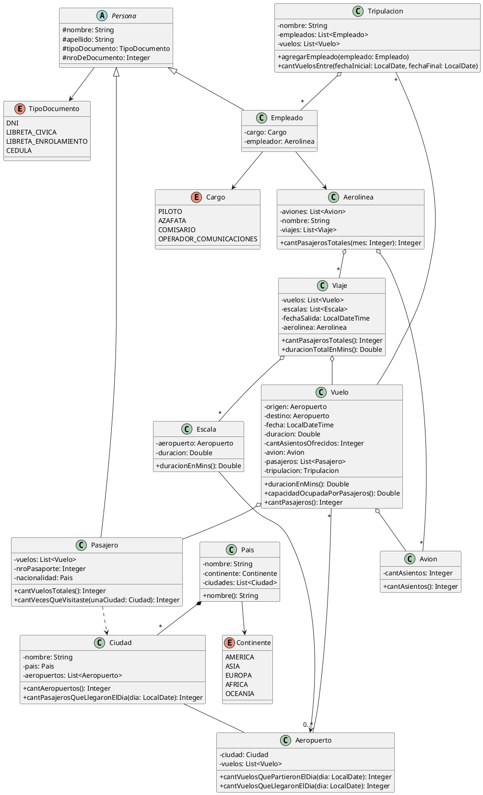

# Solución propuesta — Vuelos y Aeropuertos (diagrama de clases)

> Conversión fiel a Markdown de diagrama_de_clases_propuesto__2_.PNG (1 imagen | 1 diagrama de clases UML, 12 clases + 3 enumeraciones).

Diagrama de clases propuesto como solución al enunciado "Vuelos y Aeropuertos". El original es una imagen exportada de una herramienta de diagramación (fondo cuadriculado, estilo draw.io). Este archivo lo transcribe en tres capas redundantes: (1) el diagrama en PlantUML, renderizable con cualquier herramienta compatible; (2) el inventario verbatim de cada clase, tal cual sus compartimientos; (3) el inventario de relaciones con su notación exacta. Ante cualquier duda sobre el PlantUML, los inventarios (2) y (3) son la referencia literal.

---

## 1. Diagrama en PlantUML



---

## 2. Inventario verbatim de clases

Transcripción literal de los compartimientos de cada caja, en el orden en que figuran en el original. La visibilidad se transcribe con la notación UML del original (`#` protegido, `-` privado, `+` público).

**«enumeration» TipoDocumento**

```
DNI
LIBRETA_CIVICA
LIBRETA_ENROLAMIENTO
CEDULA
```

**«abstract» *Persona*** *(nombre en cursiva en el original)*

```
#nombre: String
#apellido: String
#tipoDocumento: TipoDocumento
#nroDeDocumento: Integer
```

**«enumeration» Cargo**

```
PILOTO
AZAFATA
COMISARIO
OPERADOR_COMUNICACIONES
```

**Empleado**

```
-cargo: Cargo
-empleador: Aerolinea
```

**Tripulacion**

```
-nombre: String
-empleados: List<Empleado>
-vuelos: List<Vuelo>
──────────────────────────
+agregarEmpleado(empleado: Empleado)
+cantVuelosEntre(fechaInicial: LocalDate, fechaFinal: LocalDate)
```

**Pasajero**

```
-vuelos: List<Vuelo>
-nroPasaporte: Integer
-nacionalidad: Pais
──────────────────────────
+cantVuelosTotales(): Integer
+cantVecesQueVisitaste(unaCiudad: Ciudad): Integer
```

**Aerolinea**

```
-aviones: List<Avion>
-nombre: String
-viajes: List<Viaje>
──────────────────────────
+cantPasajerosTotales(mes: Integer): Integer
```

**Avion**

```
-cantAsientos: Integer
──────────────────────────
+cantAsientos(): Integer
```

**Vuelo**

```
-origen: Aeropuerto
-destino: Aeropuerto
-fecha: LocalDateTime
-duracion: Double
-cantAsientosOfrecidos: Integer
-avion: Avion
-pasajeros: List<Pasajero>
-tripulacion: Tripulacion
──────────────────────────
+duracionEnMins(): Double
+capacidadOcupadaPorPasajeros(): Double
+cantPasajeros(): Integer
```

**Viaje**

```
-vuelos: List<Vuelo>
-escalas: List<Escala>
-fechaSalida: LocalDateTime
-aerolinea: Aerolinea
──────────────────────────
+cantPasajerosTotales(): Integer
+duracionTotalEnMins(): Double
```

**Escala**

```
-aeropuerto: Aeropuerto
-duracion: Double
──────────────────────────
+duracionEnMins(): Double
```

**Aeropuerto**

```
-ciudad: Ciudad
-vuelos: List<Vuelo>
──────────────────────────
+cantVuelosQuePartieronElDia(dia: LocalDate): Integer
+cantVuelosQueLlegaronElDia(dia: LocalDate): Integer
```

**Ciudad**

```
-nombre: String
-pais: Pais
-aeropuertos: List<Aeropuerto>
──────────────────────────
+cantAeropuertos(): Integer
+cantPasajerosQueLlegaronElDia(dia: LocalDate): Integer
```

**Pais**

```
-nombre: String
-continente: Continente
-ciudades: List<Ciudad>
──────────────────────────
+nombre(): String
```

**«enumeration» Continente**

```
AMERICA
ASIA
EUROPA
AFRICA
OCEANIA
```

---

## 3. Inventario de relaciones

Cada fila describe una arista tal como se dibuja en el original. "Adorno" es la punta o rombo y en qué extremo está. Las multiplicidades solo figuran si el original las escribe; las relaciones sin multiplicidad se dejan sin ella.

| # | Extremo A | Extremo B | Tipo | Adorno / multiplicidad observados |
|---|---|---|---|---|
| 1 | Empleado | Persona | Herencia | Triángulo hueco en Persona |
| 2 | Pasajero | Persona | Herencia | Triángulo hueco en Persona |
| 3 | Persona | TipoDocumento | Asociación dirigida | Flecha abierta en TipoDocumento |
| 4 | Empleado | Cargo | Asociación dirigida | Flecha abierta en Cargo |
| 5 | Empleado | Aerolinea | Asociación dirigida | Flecha abierta en Aerolinea |
| 6 | Tripulacion | Empleado | Agregación | Rombo blanco en Tripulacion · `*` en el extremo de Empleado |
| 7 | Tripulacion | Vuelo | Asociación | `*` junto al extremo de Tripulacion · sin punta distinguible (ver Notas) |
| 8 | Aerolinea | Avion | Agregación | Rombo blanco en Aerolinea · `*` en el extremo de Avion |
| 9 | Aerolinea | Viaje | Agregación | Rombo blanco en Aerolinea · `*` en el extremo de Viaje |
| 10 | Viaje | Vuelo | Agregación | Rombo blanco en Viaje · sin multiplicidad |
| 11 | Viaje | Escala | Agregación | Rombo blanco en Viaje · `*` en el extremo de Escala |
| 12 | Vuelo | Avion | Agregación | Rombo blanco en Vuelo · sin multiplicidad |
| 13 | Vuelo | Pasajero | Agregación | Rombo blanco en Vuelo · sin multiplicidad |
| 14 | Vuelo | Aeropuerto | Asociación | `*` en el extremo de Vuelo · `0..*` en el extremo de Aeropuerto · sin rombo distinguible |
| 15 | Escala | Aeropuerto | Asociación dirigida | Flecha abierta en Aeropuerto |
| 16 | Ciudad | Aeropuerto | Asociación | Sin puntas ni multiplicidades distinguibles |
| 17 | Pais | Ciudad | **Composición** | **Rombo negro en Pais** · `*` en el extremo de Ciudad |
| 18 | Pais | Continente | Asociación dirigida | Flecha abierta en Continente |
| 19 | Pasajero | Ciudad | **Dependencia** | **Línea punteada** con flecha abierta en Ciudad |

---

## Notas de conversión

- **El original es una imagen (PNG), no un PDF.** Se transcribió con inspección visual por zonas ampliadas (6 regiones a 2-3x) y zoom quirúrgico (4-5x) sobre cada punta de flecha, rombo y multiplicidad. El texto de las 15 cajas se verificó completo.
- **El layout no se preserva.** PlantUML redistribuye las cajas con su propio motor; el render no va a coincidir posicionalmente con el original. El contenido (cajas, relaciones, adornos, multiplicidades) sí es la transcripción.
- **Puntas de baja confianza (resolución del original):**
  - **Relación 7 (Tripulacion—Vuelo):** la `*` está pegada al extremo de Tripulacion (lo esperable por los atributos sería en el extremo de Vuelo, ya que `Tripulacion.vuelos` es una lista). Se transcribe donde se ve. El extremo de Vuelo no muestra punta distinguible.
  - **Relaciones 14 y 16:** no se distingue rombo en ningún extremo; se transcriben como asociaciones simples.
- **Atributos sin arista dibujada:** `Pasajero.nacionalidad: Pais` no tiene ninguna arista hacia Pais en el diagrama (la única conexión de Pasajero hacia esa zona es la dependencia punteada a Ciudad). Se transcribe tal cual.
- **Una sola arista Vuelo—Aeropuerto** a pesar de que Vuelo tiene dos atributos de ese tipo (`origen` y `destino`); la arista no lleva rótulos de rol. Se transcribe tal cual.
- **Métodos sin tipo de retorno declarado**, transcriptos tal cual el original: `agregarEmpleado(empleado: Empleado)` y `cantVuelosEntre(fechaInicial: LocalDate, fechaFinal: LocalDate)` en Tripulacion.
- **Pais** tiene un atributo `-nombre: String` y un método `+nombre(): String` con el mismo nombre. Se transcribe tal cual.
- El fondo cuadriculado y el estilo de las cajas indican exportación desde draw.io (o herramienta similar); ese estilo visual no se replica.

---

**FIN DEL ARCHIVO FUENTE — Solución propuesta — Vuelos y Aeropuertos (diagrama de clases)**
