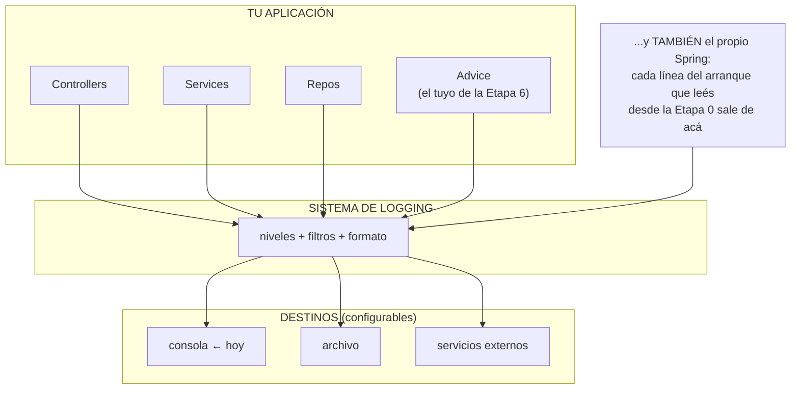
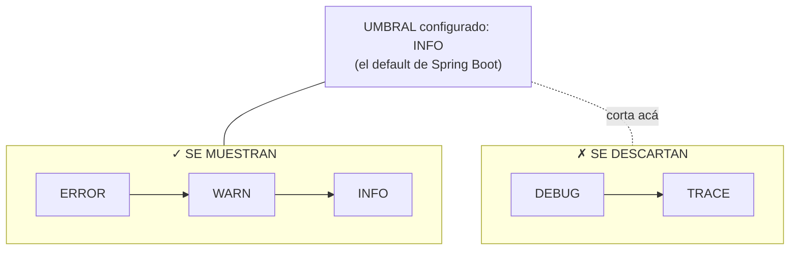
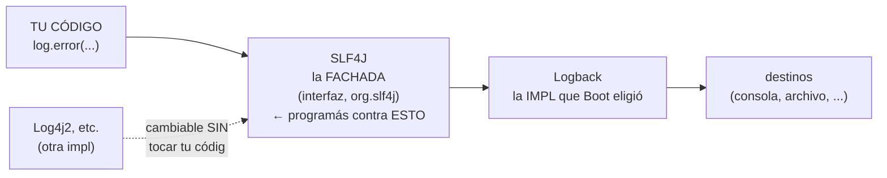

# 🌱 Proyecto 0 (clase 04) — Etapa 6B: El logger — la caja negra del avión
## ⚗️ VARIANTE PILOTO: diagramas en Mermaid

> **Nota del piloto:** este archivo es idéntico en contenido a `etapa6b-el-logger.md` — solo cambia el formato de los diagramas (Mermaid en vez de ASCII). Compará ambos en TUS visualizadores y decidí. Donde un diagrama no era un grafo (la anatomía de la línea de log), la traducción honesta fue una tabla — está señalado.

> **⭐ Extensión pedida por vos** — el logger apareció en la Etapa 6 de prepo (lo necesitábamos para curar el 500 mudo) y quedó sin su explicación de ciudadano. Acá la tiene: qué es, cómo se gradúa, por qué está armado como está, y **dónde más te lo vas a topar** — que es en todos lados.
>
> **Objetivo:** entender el logging como sistema — niveles, origen, umbral configurable, fachada — para usarlo con criterio en cualquier contexto (services, frameworks, el TP).
>
> **El momento clave:** cuando decodifiques una línea del arranque de Spring y te des cuenta de que **venís leyendo logs desde la Etapa 0 sin saberlo** — y cuando una línea en tu `application.yaml` haga aparecer y desaparecer mensajes a voluntad.
>
> **Pre-requisito:** Etapa 6 completa (el `log.error` del advice ya escrito).
>
> **Tiempo estimado:** 20-25 minutos.

---

## 🗺️ El mapa general — dónde vive el logger

A diferencia de todo lo que construiste hasta ahora, el logger **no pertenece a una capa: es transversal** — cualquier pieza puede tener el suyo:



**Archivos de esta etapa: ninguno nuevo.** Se relee tu advice, se agregan líneas temporales de experimento, y se toca (temporalmente) el `application.yaml`.

## 🧭 Mapa de esta etapa

1. **EL SISTEMA COMPLETO:** qué es (y qué no), los niveles, la fachada, los contextos.
2. Anatomía de TU logger (el del advice, línea por línea).
3. Experimento 1: los niveles en vivo (el umbral en tu `application.yaml`).
4. Experimento 2: el filtrado por origen.
5. Criterios + checkpoint + registro + 🔗.

---

## 🧠 Parte 1: EL SISTEMA COMPLETO

### 1a. Qué es — y qué NO es (`System.out.println` vs logger)

Los dos escriben texto. La diferencia es todo lo demás:

| | `System.out.println("...")` | `log.warn("... {}", id)` |
|---|---|---|
| Categoría | ninguna — un grito | **nivel** (WARN) |
| Origen | anónimo | **la clase que habló** |
| Timestamp | no | sí, automático |
| ¿Apagable sin tocar código? | imposible | **por configuración** |
| Destino | consola fija | **configurable** (consola / archivo / servicio) |

Y acá el momento prometido — **venís leyendo logs desde la Etapa 0**. Una línea cualquiera de tu arranque, decodificada campo por campo *(esto no es un grafo — la traducción honesta es una tabla)*:

```
2026-08-01T10:15:32.123  INFO 12345 --- [main] c.p.v.VeterinariaApplication : Started VeterinariaApplication in 1.8 seconds
```

| Fragmento | Qué es |
|---|---|
| `2026-08-01T10:15:32.123` | timestamp |
| `INFO` | **el NIVEL** |
| `12345` | id del proceso |
| `[main]` | el hilo |
| `c.p.v.VeterinariaApplication` | **el ORIGEN** — la clase que habló, con el package abreviado |
| `Started ... in 1.8 seconds` | el mensaje |

Cada línea del arranque de Spring ES un log con esta anatomía — Spring usa el mismo sistema que vos. Ya eras lector; hoy te volvés escritor con criterio.

### 1b. Los NIVELES — la escalera y el umbral

Cinco niveles, de más grave a más charlatán, con su criterio:

| Nivel | Cuándo | Ejemplo |
|---|---|---|
| `ERROR` | algo FALLÓ y alguien debería enterarse | "error no previsto" — tu advice |
| `WARN` | raro/sospechoso, pero seguimos | "reintento 3 de la conexión…" |
| `INFO` | hito normal de la operación | "app arrancada", "venta creada id=5" |
| `DEBUG` | detalle para diagnosticar | "request recibida con params x=…" |
| `TRACE` | paso a paso microscópico | "entrando al método tal…" |

Y la mecánica que lo vuelve poderoso — **el umbral**: configurás UN nivel, y se muestran ese **y los más graves**; los más charlatanes se descartan sin ejecutarse:



Por eso en tu consola de todos los días ves `INFO` para arriba y jamás viste un `DEBUG` — no porque no existan (Spring emite miles), sino porque el umbral los filtra. **El código queda sembrado de mensajes de todos los niveles; la configuración decide cuáles viven.** Esa separación código/configuración es el superpoder: para diagnosticar un problema en producción no agregás prints y redeployás — **bajás el umbral** y los mensajes que siempre estuvieron ahí, aparecen.

### 1c. La fachada — tu patrón de la Etapa 4, aplicado al logging

¿Por qué el import dice `org.slf4j` y no "el logger de Spring"? Porque **SLF4J no es un logger: es la interfaz** (fachada = cara visible). La implementación real que trabaja atrás es otra biblioteca (**Logback**, la que Boot trae puesta):



¿Te suena la jugada? **Es tu `PropietarioRepository` (interfaz) + `InMemoryPropietarioRepository` (impl)** — programar contra el contrato, poder cambiar la implementación sin tocar a los consumidores. El mismo patrón, aplicado por la industria entera al logging. Cuando en un proyecto ajeno veas `Log4j`, `Logback`, `java.util.logging`: son implementaciones distintas del mismo rol.

### 1d. Los contextos donde te lo vas a topar

- **Tu advice (ya):** el `log.error` de lo imprevisto — la caja negra del accidente.
- **Services, en el mundo real:** hitos de negocio en `INFO` ("venta creada id=5, total=187"), anomalías en `WARN`. Así se reconstruye qué pasó, cuando algo pasa.
- **Todo framework y biblioteca:** Spring, Jackson, los que vengan — todos emiten por este sistema; por eso bajar el umbral de un package ajeno te muestra sus tripas (Experimento 2).
- **🎯 Tu TP, textual:** el enunciado de SmartLife exige *"manejo adecuado de errores mediante el Logging SDK"* — requisito **evaluable** de tu trabajo anual, y acabás de llegarle con el concepto masticado y un caso real implementado.

---

## 🔬 Parte 2: Anatomía de TU logger (el del advice, línea por línea)

📍 Releé lo que ya escribiste en `controllers/advice/GlobalExceptionHandler.java`, ahora con ojos nuevos:

```java
private static final Logger log =
    LoggerFactory.getLogger(GlobalExceptionHandler.class);
```

- `LoggerFactory` — la fábrica de la fachada (1c).
- `getLogger(LaClase.class)` — ¿por qué recibe LA CLASE? Eso define **el ORIGEN** de cada línea (el campo que decodificaste en 1a) — y habilita el filtrado por package del Experimento 2.

```java
log.error("Error no previsto", ex);
```

- La **sobrecarga con la excepción como SEGUNDO argumento** es lo que imprime el **stacktrace completo**.
- ⚠️ `"mensaje: " + ex` (concatenar) es el anti-patrón: pierde el stacktrace — solo imprime el nombre y el message.

Y el idioma que te falta conocer, porque está en TODOS lados — **los placeholders `{}`**:

```java
log.info("Propietario {} creado con {} mascotas", id, cantidad);
//                    └┘            └┘  ← cada {} se rellena con los
//                                        argumentos, EN ORDEN — sin concatenar.
```

No es solo estética: si el nivel está apagado (un `debug` con umbral `INFO`), el mensaje **ni se arma** — la concatenación con `+` se ejecutaría igual y al vacío. El `{}` es el idiom estándar; concatenar en un log es olor a novato.

👀 *Con Lombok existe el atajo `@Slf4j` sobre la clase: te genera el campo `log` solo. Válido y muy común — en el advice quedó explícito para que vieras la pieza; en tu TP, `@Slf4j` es lo esperable.*

## 🧨 Parte 3: Experimento 1 — los niveles en vivo

Sembrá **temporalmente** la escalera completa en un método que puedas disparar fácil:

```java
// (TEMPORAL — primera línea del findAll de PropietarioServiceImpl)
// (import org.slf4j.* y el campo log, como en el advice — o probá @Slf4j)
log.trace("nivel TRACE");
log.debug("nivel DEBUG");
log.info("nivel INFO");
log.warn("nivel WARN");
log.error("nivel ERROR");
```

**Predicción:** con el umbral default de Boot (`INFO`), mandás el `GET /propietarios` — ¿cuáles de los cinco aparecen en consola?

Probá: **INFO, WARN y ERROR** — los otros dos, descartados por el umbral (1b, verificado). Ahora el superpoder — abrí tu configuración:

```yaml
# 📁 src/main/resources/application.yaml   (AGREGAR temporalmente)
logging:
  level:
    com.practica.veterinaria: DEBUG     # ← TU raíz de packages (regla de
                                        #   traducción de la Etapa 3)
```

Reiniciá, repetí el GET. **Predicción primero:** ¿cuántos ahora? → **Cuatro** (apareció DEBUG). Subilo a `TRACE` → los cinco. **Mismo código, tres comportamientos: la configuración decidió, no el redeploy.** Esa es la frase para llevarte. Limpiá: sacá las cinco líneas temporales y dejá el yaml como prefieras (tip honesto: `DEBUG` para tu package durante el desarrollo es una elección razonable y muy usada).

## 🧨 Parte 4: Experimento 2 — el filtrado por origen

¿Para qué era el "origen" (la clase que se le pasa al `getLogger`)? Para esto — el filtrado quirúrgico por package:

```yaml
logging:
  level:
    root: WARN                          # ← el mundo entero: solo problemas
    com.practica.veterinaria: DEBUG     # ← lo TUYO: charlatán
```

**Predicción:** reiniciá — ¿cómo se ve el arranque? → **Casi mudo**: las decenas de `INFO` de Spring desaparecieron (el mundo quedó en umbral WARN), pero lo tuyo habla en DEBUG. Cada logger declaró su origen al nacer (`getLogger(LaClase.class)`), y la configuración filtra **por jerarquía de packages** — podés silenciar un framework ruidoso o hacer hablar a uno solo. En un proyecto real con veinte bibliotecas, esto es supervivencia. Restaurá el yaml a gusto.

## ✅ Criterios de "Etapa 6B completa"

- [ ] Podés decodificar de memoria los campos de una línea de log del arranque.
- [ ] La escalera de niveles y la mecánica del umbral, recitables con criterio de uso.
- [ ] Los dos experimentos hechos con predicción — el yaml tocado y restaurado.
- [ ] Podés explicar la fachada SLF4J con tu propio patrón de la Etapa 4 como analogía.
- [ ] Sabés por qué `log.error("msg", ex)` ≠ `log.error("msg" + ex)`, y qué son los `{}`.

## ✅ Checkpoint

*Recall:*
1. ¿Qué cuatro cosas tiene un mensaje de log que un `println` no tiene?
2. La escalera de niveles con un ejemplo veterinario de cada uno — y ¿qué muestra exactamente un umbral en `WARN`?
3. ¿Por qué `getLogger` recibe la clase, y qué habilita eso en la configuración?
4. ¿Qué patrón que ya construiste con tus manos es SLF4J-vs-Logback? ¿Qué compra?

*Decidí y justificá:*
5. Tres escenarios — elegí herramienta y nivel, o ninguna: *(a)* querés ver el body que llega mientras desarrollás un endpoint; *(b)* un service detecta que un dato vino raro pero recuperable; *(c)* estás debuggeando un test que corre en tu máquina una sola vez.
6. La bomba de la Etapa 6 tenía `password=secreta123` — y tu `log.error` la escribió entera en consola. En producción, los logs van a archivos y servicios externos. ¿Qué regla te dicta eso sobre QUÉ se loguea? ¿Cómo convive con la "verdad plena adentro" de la Etapa 6?
7. Un compañero dejó `log.debug` con datos de cada request "total en producción el umbral es INFO y no se ven". ¿Qué riesgos le señalás? (Hay al menos dos, de naturalezas distintas.)

## 📝 Registro de la etapa

Tu línea: ¿qué te sorprendió, costó o hizo clic?

## 🔗 Conexión con la clase (y con tu TP)

El proyecto de la clase 04 no tiene logging propio (su advice es mudo — lo verificaste vos en la Etapa 6, y tu versión lo supera justamente acá). Pero la conexión grande no es con la clase: es con **el TP anual** — el enunciado de SmartLife lista, textual, *"manejo adecuado de errores mediante el Logging SDK"* como requisito de implementación de cada servicio. Cuando esa consigna llegue a tu equipo, vos ya tenés: el sistema conceptual (niveles/umbral/fachada), un caso real implementado (el advice), y dos experimentos de configuración hechos. Guardá también la conexión hacia atrás: **cada arranque de Spring que leíste desde la Etapa 0 era esto** — ahora sabés leerlo entero.

## ▶️ Próximo paso

Volvé al camino principal donde lo hayas dejado (Etapa 7 si venís en orden, o la que toque). Los tests para automatizar las verificaciones quedan estacionados donde acordamos.

---

**FIN DE LA ETAPA 6B — variante Mermaid (piloto)**
